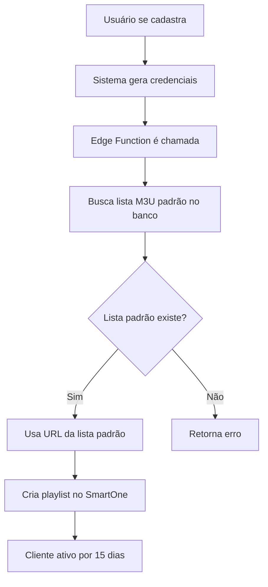

# 🎯 Setup Sistema de Lista M3U Padrão

## ⚠️ PASSO OBRIGATÓRIO - Execute o SQL

**Execute o arquivo `M3U_DEFAULT_SETUP.sql` no Supabase SQL Editor:**
https://supabase.com/dashboard/project/fcmwpbgdehtuqxcjqmxi/sql/new

Cole todo o conteúdo do arquivo e execute. Isso criará:
- Coluna `is_default` na tabela `m3u_lists`
- Trigger automático para garantir apenas uma lista padrão
- Índice para performance

## ✅ O que foi implementado

### 1. Interface Admin (`/admin/m3u-lists`)
- ⭐ Botão para marcar/desmarcar lista como padrão
- Badge "Padrão" visual nas listas marcadas
- Função `handleSetDefault()` para alternar status

### 2. Edge Function (`smartone-sync`)
- 🔍 Busca automaticamente a lista M3U padrão do banco
- ✅ Valida se existe lista padrão configurada
- 📋 Usa a URL da lista padrão para criar playlists
- ❌ Retorna erro claro se não houver lista padrão

### 3. Cadastro Externo (`/tutorial`)
- 📅 Gera **15 dias grátis** automaticamente
- 🔐 Cria credenciais M3U únicas (user_timestamp + senha aleatória)
- 🏷️ Status inicial: "Testando"
- 💰 Valor inicial: R$ 0,00 (teste grátis)

### 4. Admin Form
- 🔐 Gera credenciais automaticamente se campos vazios
- ✅ Mantém compatibilidade com credenciais manuais

## 🚀 Como usar

1. Execute o SQL no Supabase
2. Acesse `/admin/m3u-lists`
3. Clique na ⭐ da lista que deseja tornar padrão
4. Pronto! Novos cadastros usarão essa lista automaticamente

## 🔧 Funcionamento

