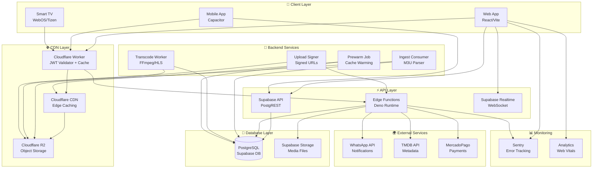
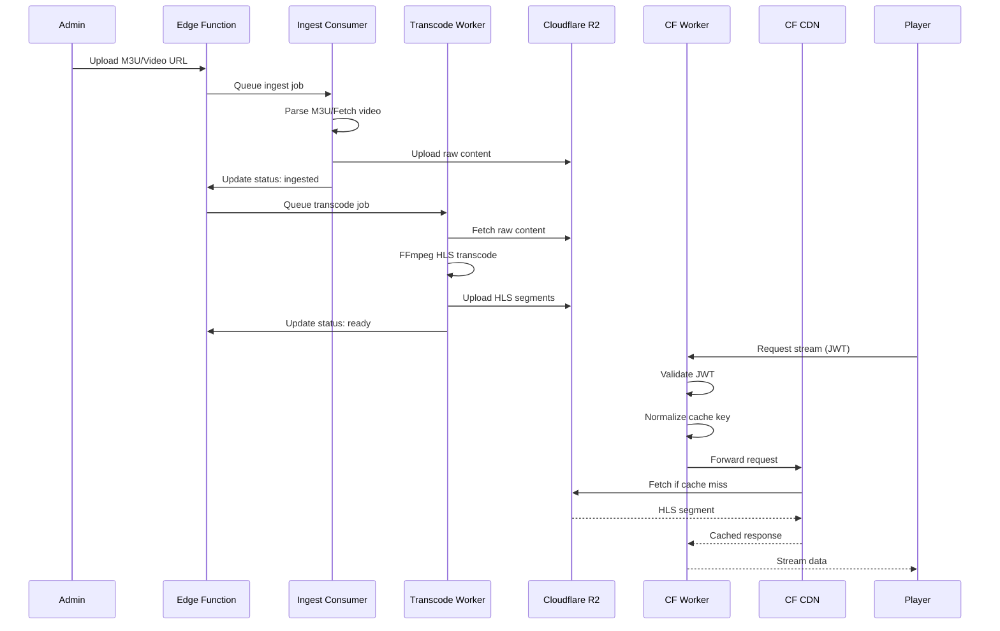
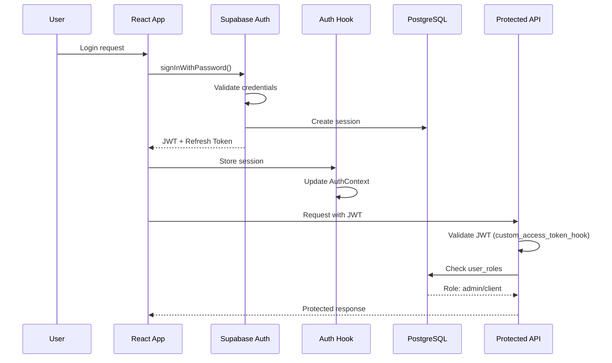
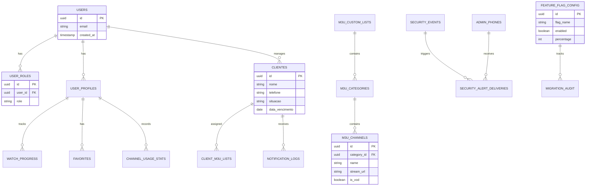
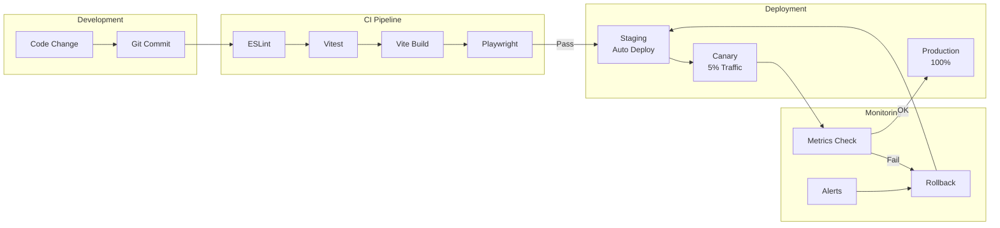

# 🏗️ IPTVLINK Architecture Diagram

## Full System Architecture



## Data Flow: Ingest → Playback



## Authentication Flow



## Feature Flag Flow

```mermaid
flowchart LR
    subgraph Config["Configuration"]
        DB_FLAGS[(feature_flag_config)]
        LOCAL[localStorage Override]
    end
    
    subgraph Service["FeatureFlagsService"]
        LOAD[Load Flags]
        CHECK[isEnabled()]
        HASH[User Hash]
    end
    
    subgraph Decision["Decision Logic"]
        OVERRIDE{Override?}
        ENABLED{Enabled?}
        DEVICE{Device Match?}
        PERCENT{Percentage?}
    end
    
    subgraph Result["Result"]
        ON[Feature ON]
        OFF[Feature OFF]
    end
    
    DB_FLAGS --> LOAD
    LOCAL --> LOAD
    LOAD --> CHECK
    CHECK --> OVERRIDE
    OVERRIDE -->|Yes| ON
    OVERRIDE -->|No| ENABLED
    ENABLED -->|No| OFF
    ENABLED -->|Yes| DEVICE
    DEVICE -->|No| OFF
    DEVICE -->|Yes| PERCENT
    HASH --> PERCENT
    PERCENT -->|Pass| ON
    PERCENT -->|Fail| OFF
```

## Database Schema Overview



## Deployment Pipeline



---

*Last updated: 2025-11-30*
