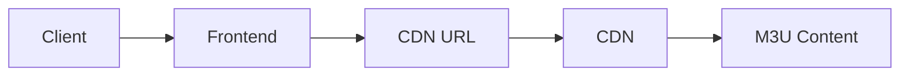
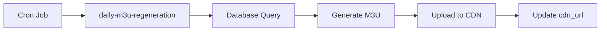

# M3U Playlist Access Pattern Documentation

## Architecture Overview

This IPTV management system uses an **API-mediated access pattern** for M3U playlist data. Clients do NOT have direct database access to M3U tables. All playlist data is accessed through secure Edge Functions that enforce business logic and access control.

## Security Model

### Database Layer (RLS Policies)

All M3U tables have Row-Level Security (RLS) enabled with **admin-only policies**:

- `m3u_custom_lists` - Admin-only CRUD
- `m3u_categories` - Admin-only CRUD
- `m3u_channels` - Admin-only CRUD
- `m3u_generation_logs` - Admin-only CRUD
- `m3u_list_favorites` - Admin-only CRUD
- `m3u_tags` - Admin-only CRUD
- `m3u_list_tags` - Admin-only CRUD
- `client_m3u_custom_assignments` - Admin-only CRUD

**Clients have NO direct SELECT access** to these tables from the frontend.

### API Layer (Edge Functions)

Playlist data is accessed through authenticated Edge Functions:

1. **`generate-m3u-file`** - Generates M3U file and uploads to CDN
   - **Authentication:** Admin-only (JWT + role verification)
   - **Purpose:** Creates M3U files from custom playlists
   - **Output:** CDN URL for client consumption

2. **`daily-m3u-regeneration`** - Scheduled regeneration
   - **Authentication:** Cron secret verification
   - **Purpose:** Automatically regenerates playlists daily
   - **Access:** Internal cron job only

### Client Access Flow

```
Client → CDN URL → M3U Content
         ↑
         |
Admin → Edge Function → Database → CDN Upload
```

Clients receive **CDN URLs** (e.g., `https://cdn.iptvlink.com.br/playlists/slug.m3u`) that serve the M3U content directly. They never query the database.

## Why API-Mediated Access?

### Security Benefits

1. **Access Control:** Business logic enforced at API layer, not just RLS
2. **Rate Limiting:** Edge Functions can implement request throttling
3. **Audit Trail:** All access logged centrally in Edge Functions
4. **Secret Protection:** Database credentials never exposed to clients
5. **CDN Integration:** Playlists served through CDN for performance and security

### Business Logic Benefits

1. **Playlist Generation:** Complex M3U assembly logic in one place
2. **Custom Formatting:** Different clients can receive different formats
3. **Usage Tracking:** Monitor which playlists are accessed
4. **Dynamic Content:** Playlists can be modified based on subscription status
5. **Caching:** CDN caching reduces database load

## Data Flow

### Admin Creates Playlist


### Client Accesses Playlist



### Scheduled Regeneration



## Implementation Guidelines

### For Frontend Developers

❌ **DO NOT:**
```typescript
// Never query M3U tables directly from frontend
const { data } = await supabase
  .from('m3u_custom_lists')
  .select('*'); // This will fail due to RLS
```

✅ **DO:**
```typescript
// Use the CDN URL assigned to the client
const cdnUrl = client.m3u_cdn_url;
// Or invoke Edge Function for admin operations
await supabase.functions.invoke('generate-m3u-file', {
  body: { customListId }
});
```

### For Backend Developers

When creating new Edge Functions that need M3U data:

1. Use `SUPABASE_SERVICE_ROLE_KEY` to bypass RLS
2. Implement authentication (JWT or cron secret)
3. Enforce business logic (subscription checks, rate limiting)
4. Log all access for audit trail
5. Return CDN URLs, not raw data

### For Database Administrators

When adding new M3U-related tables:

1. Enable RLS: `ALTER TABLE table_name ENABLE ROW LEVEL SECURITY;`
2. Create admin-only policies:
```sql
CREATE POLICY "Admins can manage" ON table_name
FOR ALL USING (public.has_role(auth.uid(), 'admin'));
```
3. Document in this file
4. Test that clients cannot directly query

## Security Checklist

- [x] RLS enabled on all M3U tables
- [x] Admin-only policies enforced
- [x] Edge Functions use service role key
- [x] JWT verification on `generate-m3u-file`
- [x] Cron secret verification on scheduled jobs
- [x] HMAC signature verification on webhooks
- [x] CDN URLs used for client distribution
- [x] No direct database access from client code

## Migration Notes

If you need to allow **limited client access** in the future (e.g., to view their assigned playlists), you would:

1. Create client SELECT policies:
```sql
CREATE POLICY "Clients can view assigned lists" 
ON m3u_custom_lists FOR SELECT
USING (
  EXISTS (
    SELECT 1 FROM client_m3u_custom_assignments
    WHERE custom_list_id = m3u_custom_lists.id
      AND cliente_id IN (
        SELECT id FROM clientes WHERE user_id = auth.uid()
      )
  )
);
```

2. Document the change in this file
3. Update frontend code to query directly
4. Remove CDN URL distribution logic (if no longer needed)

**Current Status:** API-mediated access only. No client RLS policies.

## Questions?

Contact the security team or review the security scan results at `/admin/security`.
