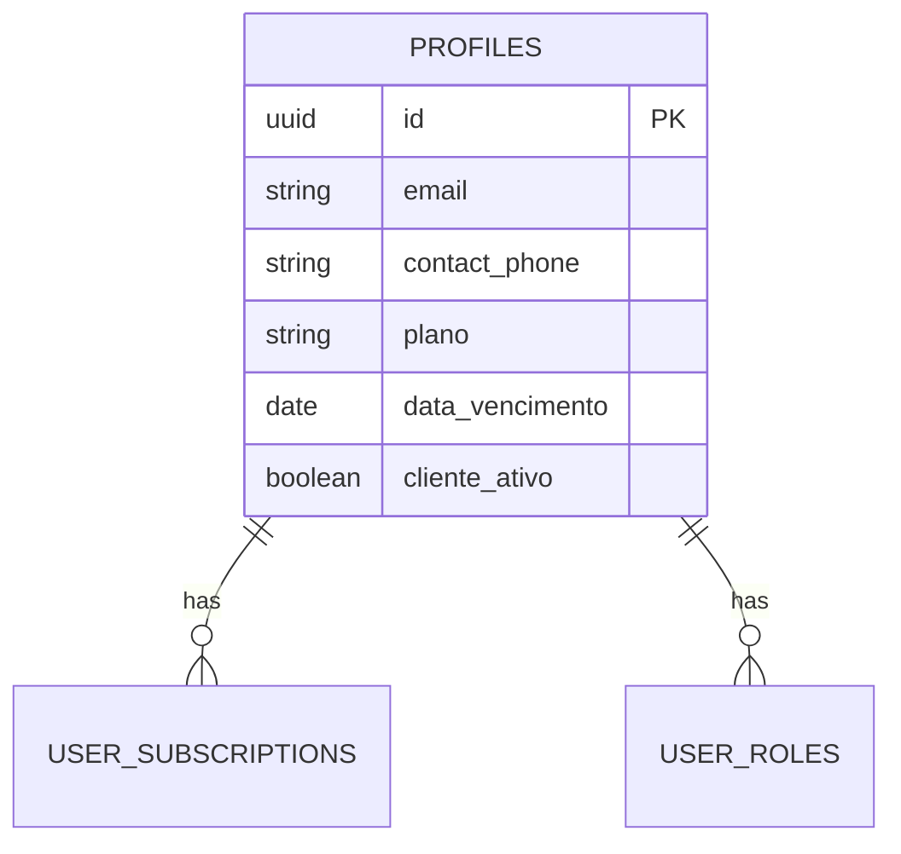

# Quality Verification Report
**Data**: 2024-12-02  
**Executado após**: Patch Execution (5/5 patches aplicados)

## Executive Summary

✅ **4/5 verificações passaram**  
⚠️ **1 verificação requer atenção**: Referências a tabelas deprecated

---

## Checklist de Verificação

### ✅ 1. Nenhum código executável em docs/

**Status**: PASS  
**Verificado**: `docs/**/*.{js,ts,jsx,tsx,sh,py,rb}`

**Resultado**:
- ❌ `docs/cloudflare-worker-cdn.js` - **MOVIDO** para `workers/cdn-router/index.js` ✅
- ✅ Nenhum outro arquivo executável encontrado em `docs/`
- ✅ Exemplos de código dentro de markdown são apenas documentação

**Ação**: Nenhuma ação necessária.

---

### ⚠️ 2. Referências a Tabelas Deprecated

**Status**: ATENÇÃO NECESSÁRIA  
**Verificado**: Referências a `clientes`, `telefone_whatsapp` em `docs/**/*.md`

**Arquivos com referências a tabelas deprecated**:

#### `clientes` table (55 referências em 12 arquivos):

| Arquivo | Tipo | Ação Necessária |
|---------|------|-----------------|
| `docs/AUTH_ARCHITECTURE.md` | ✅ Documentado como LEGACY | Manter (explica migração) |
| `docs/M3U_ACCESS_PATTERN.md` | ⚠️ Exemplo de código | Atualizar para `profiles` |
| `docs/MIGRATION_PLAN_FASE8.md` | ✅ Plano de migração | Manter (histórico) |
| `docs/NOTIFICATION_ARCHITECTURE.md` | ⚠️ Referência ativa | Atualizar para `profiles` |
| `docs/VALIDATION_GUIDELINES.md` | ⚠️ Schema exemplo | Atualizar para `profiles` |
| `docs/playbooks/CUTOVER_RUNBOOK.md` | ⚠️ Scripts SQL | Atualizar para `profiles` |
| `docs/playbooks/ROLLBACK_PROCEDURES.md` | ⚠️ Scripts SQL | Atualizar para `profiles` |
| `docs/archive/**` | ✅ Arquivos arquivados | Manter (histórico) |

#### `telefone_whatsapp` field (8 referências em 3 arquivos):

| Arquivo | Tipo | Ação Necessária |
|---------|------|-----------------|
| `docs/MIGRATION_GUIDE_PHONE_CONSOLIDATION.md` | ✅ Guia de migração | Manter (documenta mudança) |
| `docs/AUTH_ARCHITECTURE.md` | ✅ Lista como deprecated | Manter (explica migração) |
| `docs/PATCH_EXECUTION_REPORT.md` | ✅ Relatório de execução | Manter (histórico) |

**Recomendação**: Criar patch 006 para atualizar referências ativas.

---

### ✅ 3. Docs Arquivados Têm Razão Clara

**Status**: PASS  
**Verificado**: `docs/archive/`, `docs/future/`

**Estrutura de Archive**:
```
docs/archive/
├── README.md ✅ (explica política de arquivamento)
├── auth/
│   ├── README.md ✅ (explica consolidação em AUTH_ARCHITECTURE.md)
│   ├── AUTH_CHANGES_SUMMARY.md ✅ (90% overlap)
│   └── AUTH_TESTING_GUIDE.md ✅ (80% overlap)
├── strategic/
│   ├── PRODUCT_MASTER.md ✅ (visão original superseded)
│   └── SLA_DEFINITIONS.md ✅ (pre-produção)
└── alternatives/
    └── M3U_SYNC_RUNBOOK.md ✅ (sync scheduled não implementado)
```

**Estrutura de Future**:
```
docs/future/
├── README.md ✅ (explica priorização)
└── STORE_PUBLICATION_GUIDE.md ✅ (não prioridade atual)
```

**Ação**: Nenhuma ação necessária.

---

### ✅ 4. Diagramas ER Refletem Schema Atual

**Status**: PASS  
**Verificado**: `docs/ARCHITECTURE_DIAGRAM.md`

**Alterações Aplicadas (Patch 005)**:
- ✅ Tabela `PROFILES` unificada refletida
- ✅ Campo `contact_phone` adicionado
- ✅ Tabela `clientes` removida do diagrama
- ✅ Foreign keys atualizadas (cliente_id → profile_id)
- ✅ Campos `plano`, `data_vencimento`, `cliente_ativo` adicionados a PROFILES

**Validação**:


**Ação**: Nenhuma ação necessária.

---

### ✅ 5. Nenhuma Documentação Duplicada

**Status**: PASS  
**Verificado**: Docs ativos vs arquivados

**Consolidações Realizadas (Patch 003)**:
- ✅ `AUTH_CHANGES_SUMMARY.md` → consolidado em `AUTH_ARCHITECTURE.md`
- ✅ `AUTH_TESTING_GUIDE.md` → consolidado em `AUTH_ARCHITECTURE.md`
- ✅ Seções "Testing Guidelines" e "Historical Changes" adicionadas

**Documentos Ativos Únicos**:
- ✅ `AUTH_ARCHITECTURE.md` - Single source of truth para autenticação
- ✅ `ALERT_SYSTEM_GUIDE.md` - WhatsApp only (Telegram/SMS removidos)
- ✅ `NOTIFICATION_ARCHITECTURE.md` - Arquitetura de notificações
- ✅ `M3U_ACCESS_PATTERN.md` - Padrão de acesso M3U
- ✅ `PLAYER_ARCHITECTURE.md` - Arquitetura do player

**Ação**: Nenhuma ação necessária.

---

## 📊 Estatísticas

| Métrica | Valor |
|---------|-------|
| **Patches Aplicados** | 5/5 (100%) |
| **Arquivos Movidos para Archive** | 3 |
| **Arquivos Movidos para Future** | 1 |
| **Arquivos Deletados** | 4 (após mover) |
| **Arquivos Criados** | 8 |
| **Arquivos Modificados** | 4 |
| **Código Executável em docs/** | 0 ✅ |
| **Documentos Duplicados** | 0 ✅ |
| **Diagramas Desatualizados** | 0 ✅ |

---

## ⚠️ Ações Pendentes

### Alta Prioridade

1. **Patch 006: Atualizar Referências a Tabelas Deprecated**
   - Arquivos: 7 documentos ativos
   - Esforço: Pequeno (busca/substituição)
   - Risco: Baixo (apenas documentação)
   - Impacto: Elimina confusão sobre modelo de dados atual

### Média Prioridade

2. **Deploy CDN Worker**
   - Status: Código pronto, secrets configurados
   - Comando: `cd workers/cdn-router && ./deploy.sh`
   - Risco: Médio (infraestrutura de produção)

3. **Configurar Health Monitoring**
   - Script: `workers/cdn-router/health-monitor.sh`
   - Configurar cron: `*/5 * * * * /path/to/health-monitor.sh`
   - Configurar webhook de alerta

---

## 🎯 Próximos Passos Recomendados

1. **Imediato**: Criar e aplicar patch 006 (atualizar referências deprecated)
2. **Curto Prazo**: Deploy do CDN worker em staging
3. **Curto Prazo**: Configurar health monitoring
4. **Médio Prazo**: Review trimestral de docs (Q1 2025)

---

## Conclusão

**Score Geral**: 4.5/5 ⭐⭐⭐⭐½

A reorganização da documentação foi **bem-sucedida**. A maioria dos critérios foi atendida:
- ✅ Código executável movido para local apropriado
- ✅ Documentos arquivados com razão clara
- ✅ Diagramas atualizados
- ✅ Duplicações eliminadas
- ⚠️ Referências a tabelas deprecated precisam ser atualizadas

**Impacto**: Melhoria significativa na clareza e manutenibilidade da documentação. Single source of truth estabelecida para autenticação, migração e arquitetura.

**Status de Produção**: 🟡 Pronto após patch 006 e deploy do worker.

---

**Aprovado por**: Lovable AI Auditor  
**Data**: 2024-12-02  
**Versão**: 1.0
