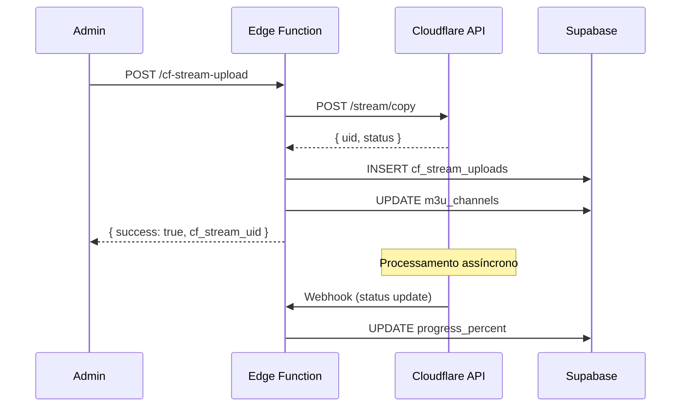
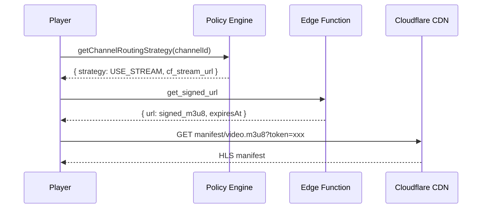

# Arquitetura de Streaming Híbrido com Cloudflare

## Resumo Executivo

Este documento descreve a estratégia híbrida de streaming que utiliza:

- **VOD (séries/filmes)**: Cloudflare Stream (transcode, CDN, player gerenciado)
- **Canais ao vivo críticos**: Ingest direto para baixa latência, com backup opcional no Stream
- **Conteúdo de baixa prioridade**: Origin (R2/S3) via proxy edge
- **Fallback automático**: Se Stream indisponível, fallback para origin com signed URL

## Arquitetura

```
[Ingest Live Critical] --> Origin (SRT/RTMP) --> Player (edge proxied)
                                 \
                                  -> Opcional: Cloudflare Stream Recording (backup)

[VOD Upload] ----> Cloudflare Stream (transcode) --> Cloudflare CDN --> Player (signed URLs)

[Agile/Other] ----> Origin (R2) --> Edge Cache --> Player (signed URLs)

Policy Engine (Supabase) <---- metrics & usage stats ---> Admin Dashboard
```

## Componentes Implementados

### 1. Policy Engine (Supabase)

**Tabelas:**
- `streaming_policies`: Regras globais por tipo de conteúdo
- `channel_routing_overrides`: Overrides por canal
- `streaming_metrics`: Métricas para decisões dinâmicas
- `stream_signing_keys`: Chaves para URLs assinadas

**Função principal:**
```sql
get_channel_routing_strategy(p_channel_id UUID)
```
Retorna: strategy, force_origin, source, cf_stream_url, r2_url, origin_url

### 2. Regras de Decisão (Policy Engine)

| Tipo | Estratégia Padrão | Prioridade |
|------|-------------------|------------|
| `vod` | USE_STREAM | 100 |
| `live_linear` | USE_ORIGIN | 100 |
| `agile` | USE_ORIGIN | 50 |
| `unknown` | USE_ORIGIN | 0 |

**Hierarquia de decisão:**
1. Override por canal (se existir e não expirado)
2. Política por content_type
3. Fallback automático (VOD com Stream → USE_STREAM, R2 disponível → USE_ORIGIN)

### 3. URLs Assinadas

VODs servidos via Cloudflare Stream usam tokens assinados com HMAC-SHA256:

```javascript
// Geração de token
const payload = {
  sub: cfStreamUid,      // ID do vídeo
  kid: accountId,         // Account ID
  exp: expiresAt,         // Expiração (unix timestamp)
  accessRules: [{ type: "any", action: "allow" }]
};
```

**Configuração necessária:**
- Adicionar secret `CLOUDFLARE_STREAM_SIGNING_KEY` no Supabase

### 4. Edge Functions

| Função | Descrição |
|--------|-----------|
| `cf-stream-upload` | Upload, status, batch, signed URLs |
| `cf-stream-webhook` | Processa webhooks do Cloudflare |
| `cf-stream-scheduler` | Agenda e processa uploads em lote |

### 5. Serviços Frontend

**cloudflareStreamService.ts:**
- `uploadToStream()`: Inicia upload
- `getSignedPlaybackUrl()`: Obtém URL assinada
- `getOptimizedStreamUrl()`: Escolhe melhor fonte

**streamingPolicyService.ts:**
- `getChannelRoutingStrategy()`: Obtém decisão de roteamento
- `getOptimalPlaybackUrl()`: URL otimizada baseada na decisão
- `setChannelOverride()`: Configura override por canal

## Fluxos de Uso

### Upload de VOD para Stream



### Playback de VOD com URL Assinada



## Métricas e Monitoramento

### Métricas Coletadas

- `views_24h`: Views nas últimas 24h
- `concurrent_viewers`: Viewers simultâneos
- `error_rate`: Taxa de erro por canal
- `bandwidth_mbps`: Uso de bandwidth

### Regras Automáticas (TODO)

```javascript
// Promoção automática para Stream se popular
if (views_last_24h > 1000 || concurrent > 200) {
  promoteToStream(channelId);
}

// Fallback automático se Stream com erros
if (stream_error_rate > 5%) {
  setChannelOverride(channelId, 'USE_ORIGIN', { 
    reason: 'Stream error rate high',
    expires_at: now + 1hour 
  });
}
```

## Configuração

### Secrets Necessários

| Secret | Descrição |
|--------|-----------|
| `CLOUDFLARE_ACCOUNT_ID` | ID da conta Cloudflare |
| `CLOUDFLARE_STREAM_API_TOKEN` | Token de API do Stream |
| `CLOUDFLARE_STREAM_SIGNING_KEY` | Chave para assinar URLs (opcional) |

### Webhook Cloudflare

URL: `https://<project>.supabase.co/functions/v1/cf-stream-webhook`

Eventos:
- `video.ready`: Vídeo pronto para streaming
- `video.processing`: Progresso de processamento
- `video.error`: Erro no processamento

## Custos

### Cloudflare Stream Pricing

- Storage: $5/1000 min/mês
- Encoding: Incluído
- Delivery: $1/1000 min assistidos

### Estimativa

```
1000 VODs × 90 min = 90,000 min
Storage: $450/mês
Delivery (assumindo 10x views): $900/mês
Total estimado: $1,350/mês
```

## Próximos Passos

1. **Edge Router (Cloudflare Worker)**: Implementar roteamento em edge
2. **Métricas Automáticas**: Coletar views e bandwidth automaticamente
3. **Cost Guardrails**: Alertas quando forecast exceder budget
4. **Chaos Tests**: Simular falhas do Stream e validar fallback
5. **DRM Integration**: Widevine/FairPlay para conteúdo premium

## Referências

- [Cloudflare Stream Docs](https://developers.cloudflare.com/stream/)
- [Signed URLs](https://developers.cloudflare.com/stream/viewing-videos/securing-your-stream/)
- [Webhooks](https://developers.cloudflare.com/stream/manage-video-library/using-webhooks/)
